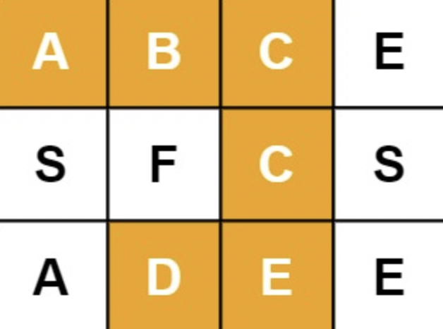
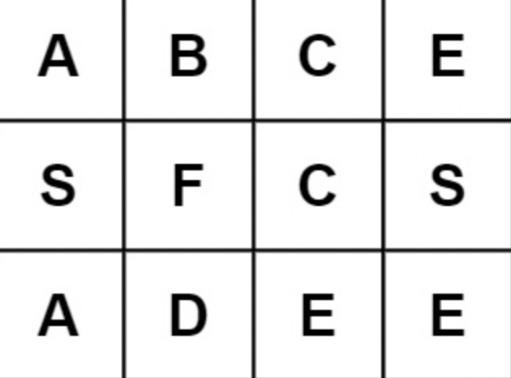

# 문제 설명

Given an `m x n` grid of characters `board` and a string `word`, return `true` if `word` exists in the grid.

The word can be constructed from letters of sequentially adjacent cells, where adjacent cells are horizontally or vertically neighboring. The same letter cell may not be used more than once.

`m x n` 크기의 2차원 문자열 배열 `board` 와 문자열 `word` 가 주어진다. 만약 배열에 `word` 가 있다면 `true`, 없으면 `false` 를 반환하는 문제.

단어는 순차적으로 상하좌우로 인접한 셀의 문자를 조합함으로써 만들 수 있다. 같은 문자 셀은 한번만 사용할 수 있다.

**Example**



```
  Input: board = [["A","B","C","E"],["S","F","C","S"],["A","D","E","E"]], word = "ABCCED"
  Output: true
```





```
  Input: board = [["A","B","C","E"],["S","F","C","S"],["A","D","E","E"]], word = "ABCB"
  Output: false
```

# 풀이 방법

DFS 와 backtracking 을 사용하여 풀었다.

1. 탐색하고자 하는 `board` 영역이 탐색하려는 `word`의 문자와 같은지 검사하기
2. 탐색하고자 하는 `board` 가 영역을 벗어나지 않는지 확인하기
3. `word` 의 마지막 탐색이 끝나면 `result` 를 `true` 로 바꾸기.

### 어려웠던 부분

`stack`, `queue` 를 사용하여 DFS 와 BFS 방법으로 풀어보려고 했는데 가던 길이 막혔을 때 기존의 isVisit 를 유지하는 방법이 떠오르지 않아 포기했다.

### 해결한 부분

그래서 `recursive` 방법으로 DFS, backtracking 을 구현했다.
isVisit 의 경우 여러 방법이 있겠으나 `row`, `col` 을 문자열로 합쳐서 깊은 복사가 가능하게 넘겨주었다.

Set 을 넘겨주는 것도 좋은 방법이었을 거라고 생각한다.

# 이전 풀이 방법

`isVisit` 없이 `word` 를 substring 메서드를 통해 자르며 문자를 검사했다.
