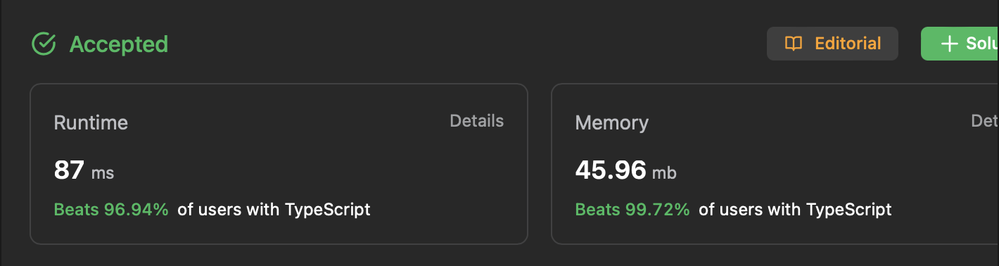

# 문제 설명

Given two sorted arrays `nums1` and `nums2` of size `m` and `n` respectively, return the median of the two sorted arrays.

The overall run time complexity should be `O(log (m+n))`.

각 크기가 `m` 과 `n` 인 정렬된 배열 `nums1` 과 `nums2` 이 주어질 때, 두 배열의 중간값을 구하여라.

시간 복잡도는 `O(log (m + n))` 이어야 한다.

**Example**

```
Input: nums1 = [1,3], nums2 = [2]
Output: 2.00000
Explanation: merged array = [1,2,3] and median is 2.
```

```
Input: nums1 = [1,2], nums2 = [3,4]
Output: 2.50000
Explanation: merged array = [1,2,3,4] and median is (2 + 3) / 2 = 2.5.
```

# 너무 장하다

