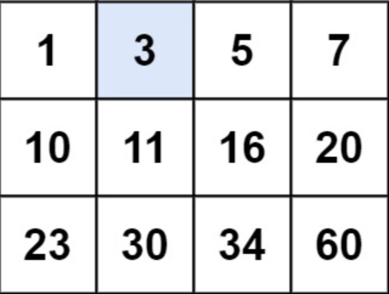
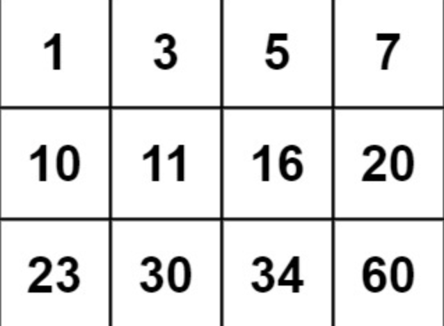

# 문제 설명

You are given an `m x n` integer matrix `matrix` with the following two properties:

- Each row is sorted in non-decreasing order.

- The first integer of each row is greater than the last integer of the previous row.

Given an integer `target`, return `true` if `target` is in `matrix` or `false` otherwise.

You must write a solution in `O(log(m * n))` time complexity.

`m x n` 크기의 행열 `matrix` 가 다음과 같이 두개의 프로퍼티로 주어진다.

- 각 행은 오름차순으로 정렬돼 있다.

- 각 행의 첫번째 정수는 이전 행의 마지막 정수보다 크다.

정수 `target` 이 주어질 때, `target` 이 `matrix` 안에 있으면 `true` 를, 없으면 `false` 를 반환한다.


**Example**



```
Input: matrix = [[1,3,5,7],[10,11,16,20],[23,30,34,60]], target = 3
Output: true
```



```
Input: matrix = [[1,3,5,7],[10,11,16,20],[23,30,34,60]], target = 13
Output: false
```