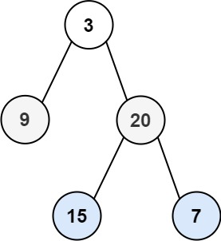

# 문제 설명

Given the `root` of a binary tree, return the level order traversal of its nodes' values. (i.e., from left to right, level by level).

이진 트리의 `root` 가 주어질때 레벨 순회를 한 결과를 반환하여라.

**Example**



```
Input: root = [3,9,20,null,null,15,7]
Output: [[3],[9,20],[15,7]]
```

```
Input: root = [1]
Output: [[1]]
```

```
Input: root = []
Output: []
```