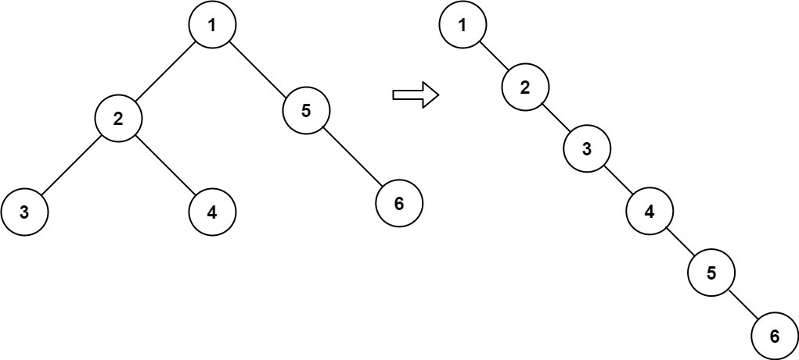

# 문제 설명

Given two integer arrays `preorder` and `inorder` where `preorder` is the preorder traversal of a binary tree and `inorder` is the inorder traversal of the same tree, construct and return the binary tree.

정수 배열 `preorder` 과 `inorder` 이 주어진다. `preorder` 은 이진 트리를 전위 순회한 정수배열이고, `inorder` 은 같은 트리를 중위순회한 배열이다.

이 두개를 조합하여 이진트리를 구축하여라.

**Example**



```
Input: preorder = [3,9,20,15,7], inorder = [9,3,15,20,7]
Output: [3,9,20,null,null,15,7]
```

```
Input: preorder = [-1], inorder = [-1]
Output: [-1]
```