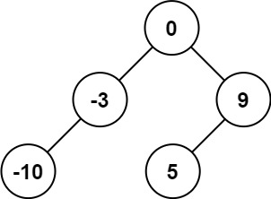

# 문제 풀이

Given an integer array `nums` where the elements are sorted in ascending order, convert it to a height-balanced binary search tree.

오름차순으로 정렬된 정수 배열 `nums` 가 주어질 때, 이것을 밸런스 트리로 바꾸어라.

**Example**



```
Input: nums = [-10,-3,0,5,9]
Output: [0,-3,9,-10,null,5]
Explanation: [0,-10,5,null,-3,null,9] is also accepted:
```