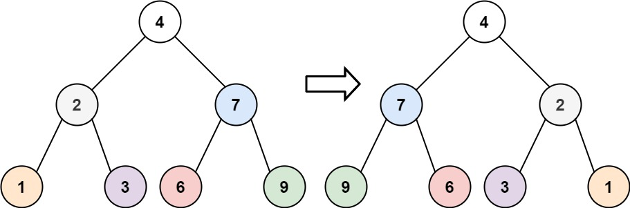

# 문제 설명

Given the `root` of a binary tree, invert the tree, and return its `root`.

바이너리 트리의 `root` 가 주어질 떄, 좌우반전한 트리의 `root` 를 반환하여라.

**Examples**



```
Input: root = [4,2,7,1,3,6,9]
Output: [4,7,2,9,6,3,1]
```