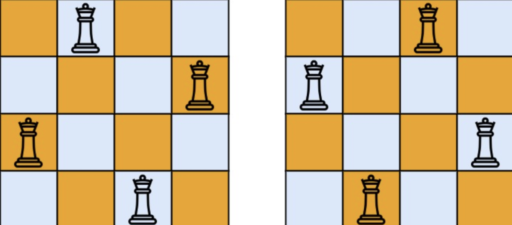

# 문제 설명

The n-queens puzzle is the problem of placing `n` queens on an `n x n` chessboard such that no two queens attack each other.

Given an integer `n`, return all distinct solutions to the n-queens puzzle. You may return the answer in any order.

Each solution contains a distinct board configuration of the n-queens' placement, where `'Q'` and `'.'` both indicate a queen and an empty space, respectively.

n-queens 문제는 `n` 개의 퀸을 `n x n` 칸의 체스보드에 서로 공격할 수 없게끔 놓는 방법을 의미한다.

정수 `n` 이 주어질 때, n-qeens 문제에서 서로 다르게 퀸을 놓는 방법을 모두 반환하는 문제. 어떤 순서로 반환하든 상관없다.

각각의 정답은 퀸인 있는 곳을 `'Q'` 로 표현하고 빈 공간을 `'.'` 으로 표현한다.

**Example**



```
Input: n = 4
Output: [[".Q..","...Q","Q...","..Q."],["..Q.","Q...","...Q",".Q.."]]
Explanation: There exist two distinct solutions to the 4-queens puzzle as shown above
4 개의 퀸을 놓는 서로 다른 방법은 그림과 같이 2가지 경우가 존재한다.
```

# 문제 해설

삽질의 삽질을 거듭한 끝에 이뤄낸 성과...


### 삽질한 이유

- NQueen 문제를 잘못이해했다. 바로 이전 행과 다음 행의 대각선만 겹치지 않으면 되는 줄 알고 대각선 타입 검사를 잘못했다.
- row, col 을 어떻게 검사해줄 것인지 계속 자료형을 바꿨다.


### board

우선 `board` 는 각 행마다 퀸이 어느 열에 위치해있는지를 나타낸다.

```jsx
board = [0, 1];
```
이라고 하면 0행엔 0열에 위치해있고, 1행엔 1열에 퀸이 위치해있음을 나타낸다.

### backtracking

현재 퀸을 놓을 `row` 위치를 받아와서 0부터 n까지 열을 차례대로 돌며 다음과 같이 퀸을 놓는다.

```jsx
board[row] = col;
```

그리고 해당 위치에 퀸을 놓는 것이 적법한지 `isValidPlace` 함수를 사용하여 검사한뒤, 다음 행으로 넘어간다.

```jsx
if (isValidPlace) {
  backtracking(row + 1); // recursive
}
```

### isValidPlace

사용자가 선택한 행열 위치에 퀸을 놓을 수 있는지 검사한다. 

1. 해당 열에 이미 퀸이 있는지 검사
    ```jsx
    for (let i = 0; i < row; i++) {
      if (board[row] === board[i]) return false;
    }
    ```

2. 대각선 방향에 퀸이 있는지 검사
    ```jsx
    for (let i = 0; i < row; i++) {
      // ...
      if (Math.abs(board[row] - board[i]) === row - i) {
        return false;
      };
    }
    ```