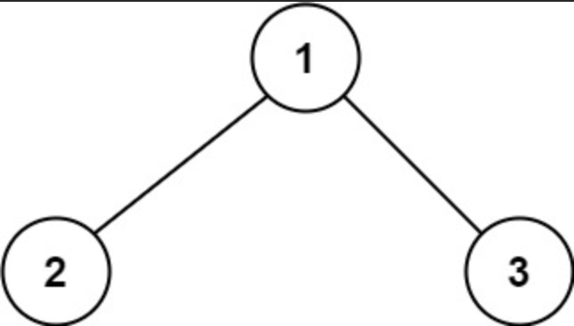
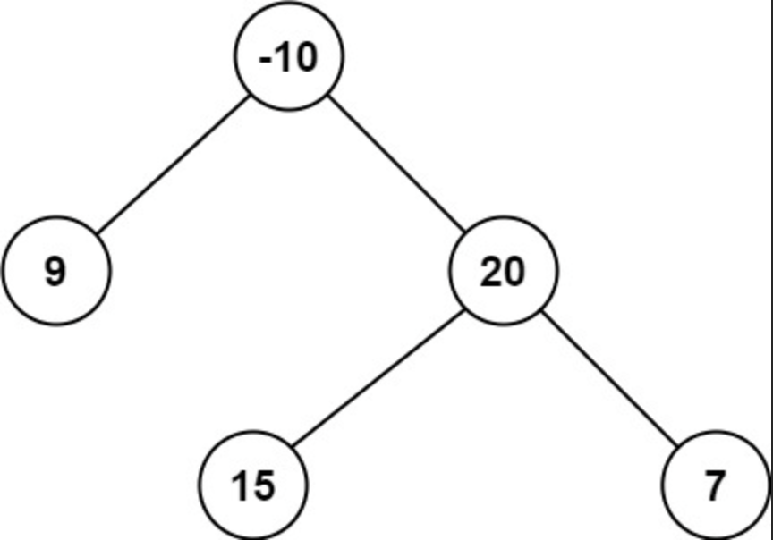

# 문제 설명

A **path** in a binary tree is a sequence of nodes where each pair of adjacent nodes in the sequence has an edge connecting them. A node can only appear in the sequence at `most once`. Note that the path does not need to pass through the root.

The **path sum** of a path is the sum of the node's values in the path.

Given the `root` of a binary tree, return the maximum path sum of any **non-empty** path.

이진 트리의 경로는 노드들의 순열이며, 순열에 속하는 각 인접한 노드 쌍엔 노드를 연결하는 엣지가 있다. 각 노드는 순열 당 최대 한 번만 나타날 수 있다. 경로가 루트를 통과할 필요는 없다.

경로의 합은 경로에 있는 노드들의 합이다.

이진 트리 `root`가 주어질때, 빈 경로가 아닌 경로의 최대 합을 구하여라.

**Examples**



```
Input: root = [1,2,3]
Output: 6
Explanation: The optimal path is 2 -> 1 -> 3 with a path sum of 2 + 1 + 3 = 6.
```



```
Input: root = [-10,9,20,null,null,15,7]
Output: 42
Explanation: The optimal path is 15 -> 20 -> 7 with a path sum of 15 + 20 + 7 = 42.
```

# 문제 풀이 

[leecode solutions - python](https://leetcode.com/problems/binary-tree-maximum-path-sum/solutions/603423/python-recursion-stack-thinking-process-diagram/?envType=study-plan-v2&envId=top-100-liked) 을 참조하여 작성했습니다.