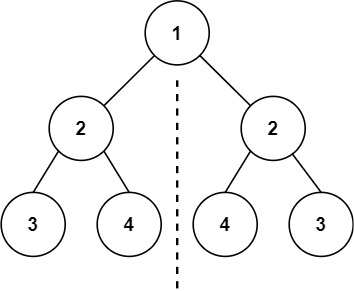
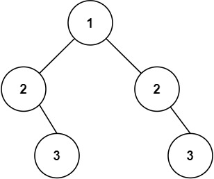

# 문제 설명

Given the root of a binary tree, check whether it is a mirror of itself (i.e., symmetric around its center).

이진 트리의 루트 노드가 주어질때 해당 이진 트리가 좌우 반전했을 때 같은지 반환하라.

**Explain**



```
Input: root = [1,2,2,3,4,4,3]
Output: true
```



```
Input: root = [1,2,2,null,3,null,3]
Output: false
```