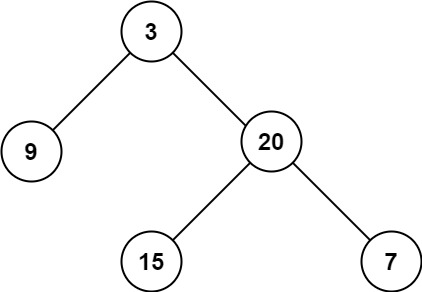

# 문제 설명

Given the root of a binary tree, return its maximum depth.

A binary tree's maximum depth is the number of nodes along the longest path from the root node down to the farthest leaf node.

이진 트리의 루트가 주어질때 최대 깊이를 구하라.

이진트리의 최대 깊이는 루트로부터 가장 멀리 떨어져 있는 리프 노드까지 거쳐야 하는 노드의 수이다.

**Example**



```
Input: root = [3,9,20,null,null,15,7]
Output: 3
```
```
Input: root = [1,null,2]
Output: 2
```