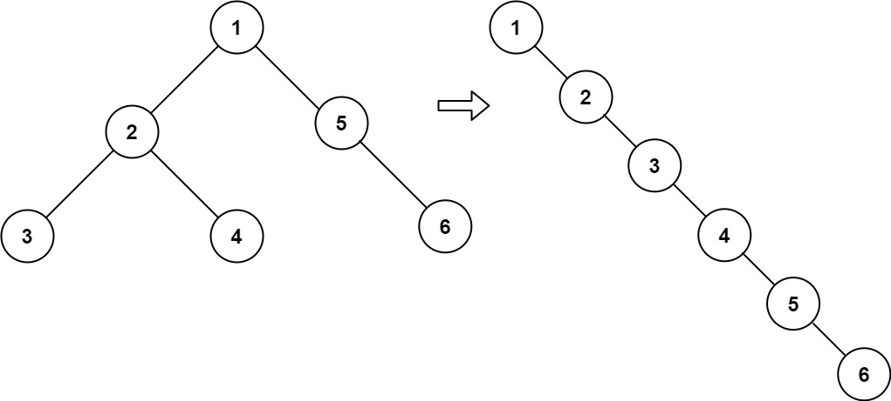

# 문제 설명

Given the `root` of a binary tree, flatten the tree into a "linked list":

The "linked list" should use the same `TreeNode` class where the `right` child pointer points to the next node in the list and the `left` child pointer is always `null`.
The "linked list" should be in the same order as a pre-order traversal of the binary tree.

이진 트리 `root` 가 매개변수로 주어질 때, "linked list" 형태로 트리를 평평하게 해라.

"linked list" 는 `right` 자식 포인트에 동일한 `TreeNode` 클래스를 사용해야 하고, `left` 에는 `null` 이어야 한다.. "linked list" 는 이진 트리의 전위 순회 순서와 같아야 한다.

**Example**



```
Input: root = [1,2,5,3,4,null,6]
Output: [1,null,2,null,3,null,4,null,5,null,6]
```