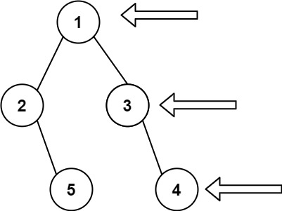

# 문제 설명

Given the `root` of a binary tree, imagine yourself standing on the right side of it, return the values of the nodes you can see ordered from top to bottom.

이진 트리의 `root` 가 주어졌을 때 이를 오른쪽 측면에서 바라보았을 경우를 상상하여, 오른쪽 측면에서 보이는 노드들을 반환하는 문제.

**Examples**



```
Input: root = [1,2,3,null,5,null,4]
Output: [1,3,4]
```