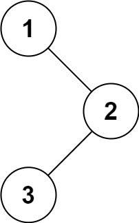

# 문제 설명

Given the root of a binary tree, return the inorder traversal of its nodes' values.

이진트리의 `root` 가 주어질대 중위 순회한 노드들의 값을 구하라.

**Explain**



```
Input: root = [1,null,2,3]
Output: [1,3,2]
```

```
Input: root = []
Output: []
```

```
Input: root = [1]
Output: [1]
```