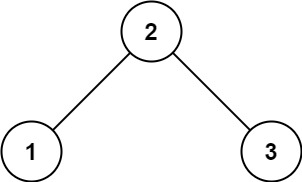
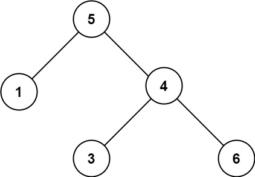

# 문제 설명

Given the `root` of a binary tree, determine if it is a valid binary search tree (BST).

A **valid BST** is defined as follows:

- The left subtree of a node contains only nodes with keys less than the node's key.

- The right subtree of a node contains only nodes with keys greater than the node's key.

- Both the left and right subtrees must also be binary search trees.

이진 트리의 `root` 가 주어질 때, 이것이 BST 트리인지 판별해라.

BST 의 조건은 다음과 같다:

- 왼쪽 서브트리의 노드들은 부모 노드의 값보다 작은 값만을 포함한다.

- 오른쪽 서브트리의 노드들은 부모 노드의 값보다 큰 값만을 포함한다.

- 왼쪽과 오른쪽 서브트리 모두 이진 트리여야 한다.

**Example**



```
Input: root = [2,1,3]
Output: true
```



```
Input: root = [5,1,4,null,null,3,6]
Output: false
Explanation: The root node's value is 5 but its right child's value is 4.
```